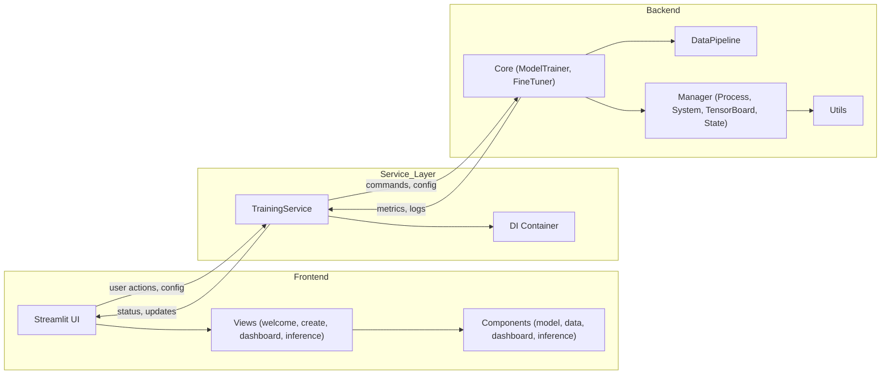
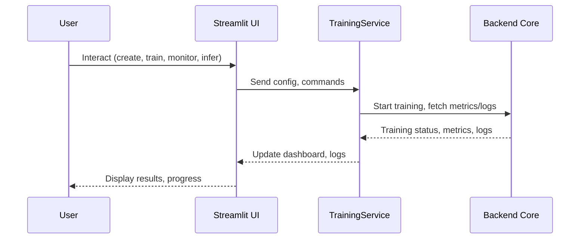

# Gemma Fine-Tuning UI

A modular interface for fine-tuning Google DeepMind’s Gemma language models. Supports real-time monitoring, multi-source data pipelines, and both standard and LoRA fine-tuning.


Project Name: Gemma Fine-Tuning UI  

---

## Project Goals and Status

### Goals
- Build an intuitive, no-code web UI to fine-tune Google DeepMind’s Gemma models.
- Allow dataset upload/selection, hyperparameter configuration, training orchestration, real-time monitoring, and model export without writing code.
- Lower the barrier for educators, researchers, and prototypers to adapt Gemma to their tasks.  


### What I built
- Frontend: Streamlit app with modular views (`welcome`, `create`, `dashboard`, `inference`) and reusable components.
- Backend: Python modules for model/training orchestration, process/system/TensorBoard managers, and utilities.
- Data: Abstractions for multi-source datasets (Hugging Face / TF / JSON) and tokenization/preview hooks.
- Training: Standard, LoRA, and QAT pathways wired through a service layer.
- Monitoring: Real-time metrics/log streaming and TensorBoard integration.
- Service Layer: A `TrainingService` that mediates the UI <-> backend lifecycle.

### Current state
- Runs locally via `streamlit run app/main.py`.
- End-to-end fine-tuning flow is operational: configure → start → monitor → export.
- Real-time metrics/logs and TensorBoard are integrated.
- Config-driven data ingestion and tokenization preview available.
- Note: Depth of each feature reflects current codebase; some parts may still be minimal or stubbed depending on your environment and Gemma install.

### What’s left
- Robust end-to-end tests across flows (data → train → monitor → export).
- Hardening: corner-case handling, retries, resource cleanup, error surfaces.
- Potential Google Vertex AI deployment pipelint support

### Upstream status
- Stands as an independent, standalone product (not merged upstream at this time).

### Challenges and learnings
- From-scratch product: designing clean boundaries between UI, service, and backend to keep iteration fast.
- Integration with the Gemma ecosystem: aligning APIs, environment setup (JAX/CUDA), and logging/metrics pluggability without leaking backend complexity into the UI.


---

## Features

- **Frontend:** Streamlit UI, modular views (welcome, model creation, dashboard, inference), component-based.
- **Backend:** Python, modular. Core training, process management, data pipeline abstraction.
- **Data:** HuggingFace, TensorFlow, or JSON datasets. Tokenization and preview supported.
- **Training:** Standard and LoRA fine-tuning. Model variants loaded dynamically.
- **Monitoring:** Real-time metrics, logs, system resource usage, TensorBoard integration.
- **Service Layer:** Connects UI to backend, manages training lifecycle, metrics, logs.

---

## Project Structure

```
gemma_fine_tuning_ui/
├── app/                # Streamlit frontend
│   ├── components/     # UI components (inference, model creation, dashboard)
│   ├── view/           # Views (welcome, create, dashboard, inference)
│   └── main.py         # Streamlit entrypoint
├── backend/            # Backend logic
│   ├── core/           # Model, optimizer, loss, checkpoint, fine-tuner, trainer
│   ├── manager/        # Process, system, tensorboard, state management
│   ├── utils/          # Utilities
│   ├── data_pipeline.py# Data pipeline abstraction
│   └── trainer_main.py # Training entrypoint (CLI)
├── services/           # Service layer (DI, training service)
├── config/             # Config/dataclasses
├── requirements.txt    # Python dependencies
```

---

## Installation

**Prerequisites:**  
- Python 3.8–3.11
- CUDA-compatible GPU recommended  
- Linux (WSL2 or native)

**Install:**
```bash
git clone https://github.com/drink970082/GSoC-2025-Gemma-Model-Fine-tuning-UI.git
cd gemma_fine_tuning_ui

# System dependencies
sudo apt-get update
sudo apt-get install -y pkg-config cmake

# Python dependencies
pip install -e .

# JAX (choose one)
pip install jax           # CPU only
pip install jax[cuda12]   # NVIDIA GPU
```

---

## Usage

```bash
streamlit run app/main.py
```
Open [http://localhost:8501](http://localhost:8501) in your browser.

---

## Workflow

1. **Welcome:** Choose to create a new model or use existing checkpoints.
2. **Model Creation:** Select model variant, fine-tuning method (Standard/LoRA/QuantizationAware(QAT)), data source, and training params.
3. **Dashboard:** Monitor training progress, metrics, logs, and system usage.
4. **Inference:** Test your fine-tuned model interactively.

---

## Data Pipeline

- **Sources:** HuggingFace, TensorFlow, JSON
- **Preview:** Raw and tokenized preview before training
- **Transforms:** Configurable prompt/response fields, tokenization, truncation

---

## Training

- **Methods:** Standard, LoRA, QAT
- **Variants:** Any Gemma model supported by `gemma.gm.nn`
- **Checkpoints:** Automatic, with recovery and cleanup

---

## Monitoring

- **Metrics:** Real-time KPIs, loss curves, learning rates
- **System:** GPU/CPU/memory usage, logs, error reporting
- **TensorBoard:** Integrated

---

## Screenshots


---

## System Architecture


## Data Flow



---
